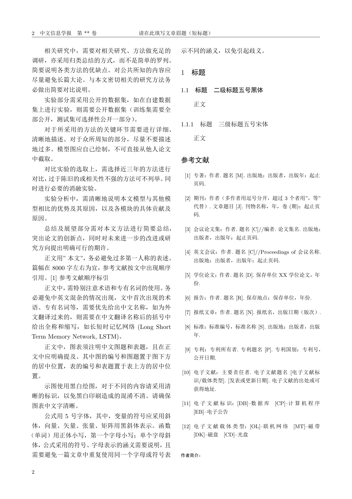
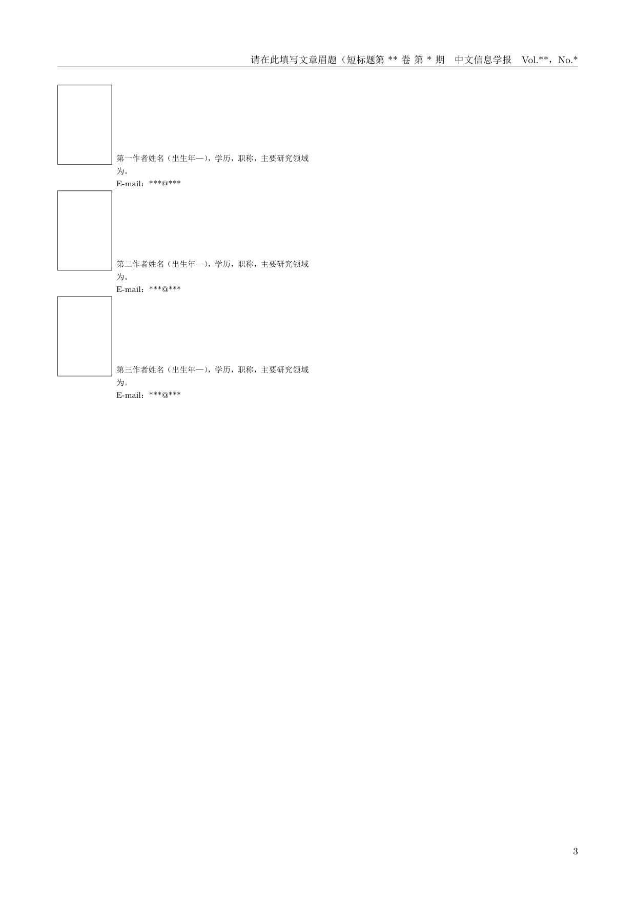

# Jcip Latex Template

<!-- PORTFOLIO-SNAPSHOT:START -->
<p align="left">
  
  
</p>

> Clean LaTeX template for 中文信息学报 papers, with guided source, preview pages, and academic writing defaults.

## Project Snapshot

- Category: Research and academic tooling
- Stack: TeX, academic-writing, latex, paper-template, tex, chinese-journal
- Status: Public portfolio artifact

## What This Demonstrates

- Presents the project with a clear purpose, technology stack, and review path.
- Emphasizes reproducible research, academic writing, or measurable experiment artifacts.
- Keeps implementation details and usage notes close to the code for easier reuse.

## Quick Start

```bash
xelatex jcip_guided_template.tex
```

<!-- PORTFOLIO-SNAPSHOT:END -->

## Original Documentation

[English](./README_en.md) | 简体中文

<!-- 徽章 -->
[](https://github.com/handsomeZR-netizen/jcip-latex-template/stargazers)
[](https://github.com/handsomeZR-netizen/jcip-latex-template/network/members)
[](https://github.com/handsomeZR-netizen/jcip-latex-template/blob/main/LICENSE)

## 项目简介

本项目是一套基于 **中文信息学报** 格式规范的 LaTeX 学术论文模板，旨在为研究者提供一个简洁、优雅、易用的论文撰写环境。

本模板严格参考中文信息学报的官方投稿要求开发，涵盖了论文的基本结构、格式规范、图表排版、参考文献样式等，可直接用于准备投稿论文或学术报告。

> 💡 **直接复用**：下载模板后，仅需替换论文内容即可开始撰写，无需繁琐的格式调整。

## 模板预览

以下是基于本模板生成的示例论文效果：

### 第一页


### 第二页


### 第三页


*图 1：中文信息学报 LaTeX 模板渲染效果示例*

## 兼容环境

本模板支持以下 LaTeX 编译环境：

| 环境 | 版本要求 | 推荐程度 | 说明 |
|------|----------|----------|------|
| **Overleaf** | 任意版本 | ⭐⭐⭐⭐⭐ | 在线编译，无需本地安装，推荐新手使用 |
| **TeX Live** | 2024+ | ⭐⭐⭐⭐⭐ | Windows/macOS/Linux 跨平台官方发行版 |
| **MiKTeX** | 最新版 | ⭐⭐⭐⭐ | Windows 用户轻量选择 |

### Overleaf 使用方法

1. 访问 [Overleaf](https://www.overleaf.com/)
2. 创建新项目，上传 `jcip_guided_template.tex` 文件
3. 选择 XeLaTeX 编译器（项目设置中修改）
4. 点击编译即可生成 PDF

### TeX Live 使用方法

```bash
# XeLaTeX 编译（推荐，支持中文）
xelatex jcip_guided_template.tex
xelatex jcip_guided_template.tex  # 运行两次生成目录和交叉引用
```

## 主要特性

| 特性 | 描述 |
|------|------|
| 📄 **开箱即用** | 下载后直接使用，无需复杂配置 |
| 🎨 **格式规范** | 严格遵循中文信息学报投稿规范 |
| 📊 **图表支持** | 支持浮动体、双栏图表、跨栏图表 |
| 📐 **数学公式** | 完整的 AMS 数学环境支持 |
| 📚 **参考文献** | 符合国家标准的 GB/T 7714 引用格式 |
| 🔄 **跨平台** | Windows、macOS、Linux 均可使用 |
| 🆓 **开源免费** | MIT 许可证，可自由使用和修改 |

## 目录结构

```
jcip-latex-template/
├── jcip_guided_template.tex      # 主模板文件（直接编辑此文件）
├── jcip_guided_template.pdf      # 编译后的示例论文
├── preview_page1.png      # 第1页预览图
├── preview_page2.png      # 第2页预览图
├── preview_page3.png      # 第3页预览图
├── README.md               # 项目说明（中文）
├── README_en.md            # 项目说明（英文）
└── LICENSE                 # MIT 许可证
```

## 快速开始

### 环境要求

- LaTeX 发行版（推荐 TeX Live 2024+ 或 MiKTeX）
- 支持 XeLaTeX 或 pdfLaTeX 编译
- Overleaf 在线编辑（无需本地环境）

### 使用步骤

#### 方式一：Overleaf 在线编辑（推荐）

1. **克隆或下载本仓库**
   ```bash
   git clone https://github.com/handsomeZR-netizen/jcip-latex-template.git
   ```

2. **上传到 Overleaf**
   - 登录 [Overleaf](https://www.overleaf.com/)
   - 创建新项目，将 `jcip_guided_template.tex` 内容复制粘贴或上传

3. **设置编译器**
   - 点击右上角菜单 → 项目设置
   - 编译器选择：`XeLaTeX`

4. **编译并下载 PDF**
   - 点击"重新编译"按钮
   - 生成的 PDF 直接下载即可

#### 方式二：本地 TeX Live 编译

1. **安装 TeX Live**
   - 下载地址：https://www.tug.org/texlive/
   - Windows 用户建议使用 `texlive.iso` 镜像安装

2. **编译生成 PDF**
   ```bash
   # 进入项目目录
   cd jcip-latex-template

   # XeLaTeX 编译（推荐，支持中文）
   xelatex jcip_guided_template.tex
   xelatex jcip_guided_template.tex  # 运行两次以生成目录和交叉引用

   # 或使用 pdfLaTeX
   pdflatex jcip_guided_template.tex
   pdflatex jcip_guided_template.tex
   ```

3. **查看结果**
   生成的 `jcip_template.pdf` 即为最终的论文文件。

## 模板结构说明

### 文档类

本模板使用标准 `article` 文档类，并根据中文信息学报要求进行配置：

```latex
\documentclass[UTF8, a4paper, 10pt]{article}
```

### 主要组成部分

| 部分 | 命令 | 说明 |
|------|------|------|
| 标题 | `\mytitle{}` | 论文中文标题 |
| 作者 | `\myauthor{}` | 作者姓名 |
| 单位 | `\myinstitution{}` | 作者单位 |
| 摘要 | `\mysummary{}` | 中文摘要（200-300字） |
| 关键词 | `\keywords{}` | 3-5个关键词 |
| 正文 | `section`、`subsection` | 使用标准章节命令 |
| 参考文献 | `thebibliography` | GB/T 7714 格式 |

### 图表插入示例

```latex
% 插入图片
\begin{figure}[htbp]
  \centering
  \includegraphics[width=0.8\textwidth]{figure.png}
  \caption{图片标题}
  \label{fig:example}
\end{figure}

% 插入表格
\begin{table}[htbp]
  \centering
  \caption{表格标题}
  \begin{tabular}{ccc}
    \hline
    列1 & 列2 & 列3 \\
    \hline
    数据 & 数据 & 数据 \\
    \hline
  \end{tabular}
  \label{tab:example}
\end{table}
```

### 数学公式示例

```latex
% 行内公式
欧拉公式 $e^{i\pi} + 1 = 0$ 是数学美的体现。

% 独立公式
\begin{equation}
  E = mc^2
  \label{eq:einstein}
\end{equation}
```

## 常见问题

### Q1: Overleaf 编译报错怎么办？

**解决方案**：
1. 确保编译器设置为 XeLaTeX（项目设置 → 编译器 → XeLaTeX）
2. 点击"重新编译"按钮
3. 如仍有问题，检查是否有缺失的宏包（Overleaf 会自动提示）

### Q2: 本地编译报错 "LaTeX Error: File 'xxx.sty' not found"

**解决方案**：安装缺失的宏包。
- TeX Live：`tlmgr install <package-name>`
- MiKTeX：运行 `mpm --install=<package-name>`

### Q3: 中文显示为方块

**解决方案**：
- Overleaf：确保选择 XeLaTeX 编译器
- 本地：使用 XeLaTeX 编译，并使用 UTF-8 编码保存源文件

### Q4: 图表位置不正确

**解决方案**：LaTeX 浮动体会自动调整位置，如需强制使用 `[H]` 选项，请加载 `float` 宏包：
```latex
\usepackage{float}
```

## 贡献指南

欢迎提交 Issue 和 Pull Request！

1. **Fork 本仓库**
2. **创建特性分支** (`git checkout -b feature/AmazingFeature`)
3. **提交更改** (`git commit -m 'Add some AmazingFeature'`)
4. **推送分支** (`git push origin feature/AmazingFeature`)
5. **创建 Pull Request**

## 参考文献格式说明

本模板使用 GB/T 7714-2015 参考文献格式，主要类型示例：

```latex
% 期刊论文
[1] 张三, 李四. 论文标题[J]. 期刊名称, 2020, 40(3): 1-10.

% 会议论文
[2] 王五, 赵六. 会议论文标题[C]// 会议名称. 2021: 123-130.

% 学位论文
[3] 孙七. 学位论文标题[D]. 北京: 北京大学, 2019.

% 专著
[4] 周八. 书名[M]. 北京: 出版社, 2018.
```

## 许可证

本项目采用 [MIT License](LICENSE) 许可证。

---

**🌟 如果这个项目对你有帮助，请给我们一个 Star！**

*Built with ❤️ by [handsomeZR-netizen](https://github.com/handsomeZR-netizen)*
